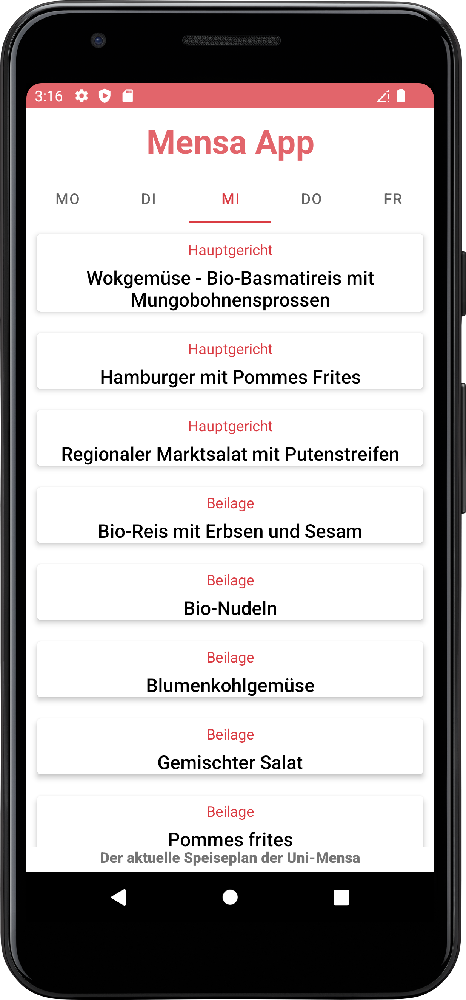
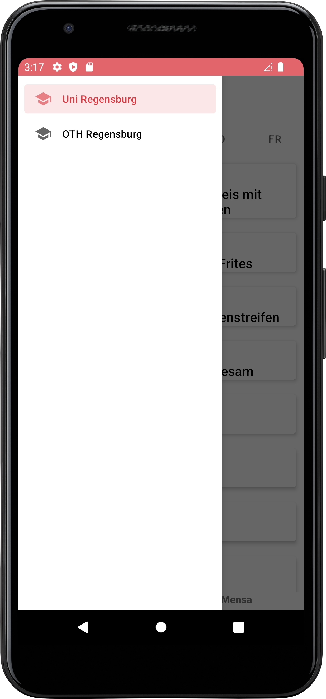

# U07 Mensa App
In dieser Woche implementieren wir eine App, die den aktuellen Mensa Speiseplan der aktuellen Woche in verschiedenen Hochschulen anzeigen kann.

## Aufgabe
Die hier entwickelte App soll den Mensaplan der aktuellen Woche für verschiedene Mensen anzeigen können. Dazu werden die entsprechenden Daten von einer *Web API* angefragt und im UI aufbereitet angezeigt. Die Nutzenden sollen in der Lage sein, zwischen den Wochentagen zu wechseln und für jeden Wochentag der laufenden Woche alle Gerichte angezeigt zu bekommen. Zusätzlich soll über einen [*NavigationDrawer*](https://material.io/components/navigation-drawer/android#modal-navigation-drawer) die Auswahl anderer Hochschulen möglich sein.

## Starterpaket
Im Starterpaket finden Sie einige Vorgaben, die den Start der Implementierung erleichtern. Die *MainActivity* ist bereits als *NavigationItemSelectedListener* registriert. Somit kann, durch Wischen von links nach rechts, die Navigation geöffnet werden. Durch Klicken auf einen Eintrag wird dieser als aktiv markiert und die Leiste wieder geschlossen. Die Auswirkungen dieser Auswahl auf die restliche Anwendung müssen aber noch implementiert werden. Außerdem wurde in der MainActivity bereits ein Listener auf das *TabLayout* registriert, in welchem die Wochentage angezeigt und ausgewählt werden. In der `onTagSelected` Methode des anonymen inneren `TabSelectedListener` können Sie auf Klicks auf einzelne Tabs reagieren. Die Position des angeklickten Tabs erhalten Sie durch `tab.getPosition()`.

Darüber hinaus sind der `MensaDataAdapter` und der `MensaDataViewHolder` bereits vorgegeben. Diese erlauben es durch Aufruf der `setMenu()` Methode des *MensaDataAdapters* Views für die übergebene `ArrayList` von `MensaDish` Objekten zu erzeugen und in einem *RecyclerView*, der im *activity_main* layout zu finden ist, einzufügen. RecyclerView und Adapter müssen aber noch verbunden werden und der Aufruf der `setMenu` Methode muss an geeigneter Stelle umgesetzt werden.

Die Klasse `MensaDish` ist ebenfalls gegeben. Diese repräsentiert ein einzelnes Gericht des Menüs. Ein Gericht wird beschrieben durch einen Namen, einen Tag an dem es verfügbar ist und eine Kategorie (Hauptgericht, Beilage, Dessert).

Zusätzlich sind drei **Enums** gegeben die mögliche Kategorien der Gerichte, Wochentage, an denen die Mensen offen haben und Orte, die in der App und API verfügbar sind, abbilden.

## Daten
Die Daten/Menüs sind über den Link *https://mensa.software-engineering.education/mensa/$PLACE/$DAY* verfügbar. Dabei muss `$PLACE` durch einen Code für eine Mensa (siehe Places enum) und `$DAY` durch eine Kurzbezeichnung eines Wochentags (siehe Weekday enum) ausgetauscht werden. Die API liefert als Antwort einen JSON-formatierten String. Die oberste Ebene bildet dabei ein JSON-Array, in diesem sind mehere JSON-Objekte enthalten, wovon jedes ein Gericht repräsentiert. Die Objekte haben die folgende Form:

```json
[{
    "name": "name des gerichts",
    "day": "Wochentag Kurzform",
    "category": "Kategorie",
    "labels": "Label z.B. als vegan",
    "cost": {
        "students": "Preis für Studierede z.B. 0,75",
        "employees": "Preis für Mitarbeitende",
        "guests": "Preis für andere"
    },
    "id": 111,
    "upvotes": 0,
    "downvotes": 0
},
]
```
Für uns relevant sind dabei nur die Felder `name`, `day` und `category`. Sie können die API auch ohne App testen, rufen Sie dazu einfach die URL im Browser auf. (z.B. https://mensa.software-engineering.education/mensa/uni/di)

## Allgemeine Hinweise

* Verwenden Sie für die Anfragen an den Server das _Volley_-Framework, das [hier](https://developer.android.com/training/volley) näher beschrieben wird. Wir haben die _Library_ bereits in der _Gradle_-Datei des Starterpakets eingetragen.
* Die JSON-formatierte Antwort des Servers können Sie über die Funktionalitäten der Klassen [`JSONArray`](https://developer.android.com/reference/org/json/JSONArray) und [`JSONObject`](https://developer.android.com/reference/org/json/JSONObject) verarbeiten und in eigene Objekte überführen.

## Vorgehen

### Schritt 1: Starterpaket öffnen
Laden Sie sich das Starterpaket herunter und öffnen Sie dieses in Android Studio. Machen Sie sich mit dem vorgegebenen Code vertraut und versuchen Sie das Starterpaket auf dem Emulator (oder ihrem physischen Smartphone) auszuführen.

**Zwischenziel**: Das Starterpaket kann auf dem Emulator ausgeführt werden. Dabei wird eine leere Liste, eine Wochentagauswahl und eine Überschrift angzeigt. Durch Wischen von links nach rechts kann die Navigationsleiste geöffnet werden.

### Schritt 2: Anzeigen von Gerichten im UI
Erzeugen Sie nun eine Klasse, welche die Gerichte in einer Liste verwaltet. Die Klasse sollte außerdem eine Methode bereitstellen, mit der alle Gerichte für einen übergebenen Wochentag (verwenden Sie das `WeekDay` Enum) zurückgegeben werden können. Fügen Sie zum Testen im Konstruktor der Klasse einige Gerichte zur Liste hinzu. Den Code zum Hinzufügen dieser Gerichte sollten Sie nach Abschluss dieses Schrittes wieder entfernen.

Verbinden Sie nun den RecyclerView aus dem Layout mit einem Adapter (`MensaDataAdapter` Klasse). Sorgen Sie dafür, dass beim Klick auf einen Wochentag im *TabLayout* die Gerichte, die in der Liste von Gerichten verfügbar sind und zu diesem Wochentag passen im RecyclerView angezeigt werden.

**Zwischenziel**: Beim Starten der Anwendung sollten nun die programmatisch hinzugefügten Gerichte in der Liste angezeigt werden, wenn der passende Wochentag ausgewählt ist bzw. angeklickt wurde.

### Schritt 3: API Anfrage stellen
Erzeugen Sie nun eine Klasse mit der Sie Anfragen an die API stellen können. Die Klasse sollte die Möglichkeit bieten, eine Anfrage für einen übergebenen Ort (verwenden Sie das `Places` Enum) zu stellen. Die Objekte der Klasse sollten im besten Fall so gestaltet werden, dass Sie *single use* Objekte sind, also nur für genau diese einmalige Anfrage verwendet werden können. Für jede weitere, spätere Anfrage braucht man ein daher neues Anfrageobjekt.

Bei einer Anfrage sollten alle Gerichte für die gesamte Woche (jeden Tag im `WeekDay` Enum) geladen werden. Nutzen sie dafür die `RequestQueue` Klasse des Volley Frameworks. Eine neue Queue erstellen Sie über `Volley.newRequestQueue(context)`. Dieser queue (engl. Warteschlange) können Sie dann Anfragen, in Form von `JSONArrayRequest` Objekten, hinzufügen und anschließend alle Anfragen auf einmal über die `start` Methode der Queue abschicken.

Ein `JSONArrayRequest` Objekt erstellen Sie über `new JSONArrayRequest()`, wobei die API-URL, ein `Response.Listener` und ein `Response.ErrorListener` übergeben werden müssen. Implementieren Sie die Listener Interfaces in Ihrer Klasse.

Loggen Sie vorerst die Antworten der API auf der Konsole. Aus einem **JSONArray** können Sie einen String machen, indem Sie die `.toString()` Methode des Objekts aufrufen. Erzeugen Sie dann im Konstruktor der Klasse, die Sie zur Verwaltung Ihres Menüs nutzen, eine Instanz Ihrer neuen Klasse für Anfragen. Stellen direkt nach dem Erzeugen des Objekts die initiale Anfrage für die Mensa der Universität Regensburg.

**Zwischenziel**: Beim Start der Anwendung sollten auf der Konsole fünf JSON-Strings ausgegeben werden, die den Menüs der einzelnen Wochentage in der Mensa der Universität Regensburg entsprechen.

### Schritt 4: Erzeugen von Mensa Dishes
Verwenden Sie nun die JSONArrayObjekte, die Sie von der API erhalten, um basierend darauf Objekte der Klasse `MensaDish` zu erstellen. Ein Objekt dieser Klasse repräsentiert dabei genau ein Gericht. Schreiben Sie dazu eine neue Methode (bestenfalls statisch in der `MensaDish` Klasse), die ein `JSONArray` Objekt übergeben bekommt und ein fertiges `MensaDish` Objekt zurückgibt. Nutzen Sie diese, um alle Gerichte der aktuellen Woche als MensaDishes abzuspeichern und fügen Sie diese zu Ihrer Liste an aktuellen Gerichten hinzu.

Überschreiben Sie nun in der `MensaDish` Klasse die `toString` Methode, so dass diese alle Informationen über das aktuelle Gericht als String (schön) formatiert zurückgibt. Nutzen Sie diese Methode, um die Informationen über jedes gespeicherte Gericht auf der Konsole auszugeben.

**Zwischenziel**: Beim Start der App sollten nun Log Ausgaben erscheinen, die alle von der API geladenen Gerichte, in Form von *MensaDish* Objekten, beschreiben.

### Schritt 5: Verbinden von API und UI
Nun wollen wir die von der API geladenen Daten im UI anzeigen. Verwenden Sie dazu an geeigneten Stellen Listener. Nachdem aus allen JSON Objekten *MensaDish* Objekte erzeugt und gespeichert wurden, muss der Adapter informiert werden, dass die Gerichte sich geändert haben. Dadurch wird das UI angepasst. Achten Sie darauf, dass die Gerichte für den korrekten, aktuell selektierten Tag angezeigt werden.

**Zwischenziel**: Beim Aufruf der Anwendung wird das Wochenmenü der Mensa der Universität Regensburg von der API geladen und in der Liste angezeigt. Man kann zwischen Wochentagen wechseln.

### Schritt 6: Andere Mensen
Sorgen Sie nun dafür, dass Menüs anderer Mensen abgefragt werden können. Die Nutzenden sollen beim Klick auf ein Element in der Navigationsleiste eine andere Mensa auswählen können. Der Klick auf ein Element des Navigationsmenüs wird in der `onNavigationItemSelected` Methode abgefangen. Nutzen Sie das `Places` Enum, um die API Anfrage dahingehend zu ändern, dass Daten eines anderen Ortes abgefragt werden. Achten Sie darauf, dass bei jedem Aufruf der API fünf Antworten gebraucht werden. Sorgen Sie dafür, dass (nur) das Menü der selektierten Mensa in der Liste angezeigt wird.

Beachten Sie, dass es auch sinnvoll sein könnte, andere Elemente des UIs anzupassen und z.B. den informierenden Text im UI zu ändern.

**Zwischenziel**: Die Mensa kann nun gewechelt werden. Bei der Auswahl einer anderen Mensa wird das angezeigte Menü entsprechend der Antwort der API geändert.

### Schritt 7: Ladebalken
Eine Anfrage an die API kann je nach Internetverbindung, Serverauslastung und Gerät unterschiedlich lange dauern. Wir wollen daher die Nutzenden informieren, dass noch etwas im Hintergrund passiert und bald eine Antwort des Servers zu erwarten ist. Das machen wir am besten über die Einblendung eines Ladebalkens oder "Laderings".

Erstellen Sie dafür zunächst ein neues Layout, dass in den *RecyclerView* eingefügt werden kann, wenn Daten von der API geladen werden. Um einen Ladering einzublenden verwenden wir das `ProgressBar` View.  Über die Verwendung dieses Layoutelements können Sie sich [hier](https://developer.android.com/reference/android/widget/ProgressBar) informieren. Da wir nicht wissen, wie lange es dauert bis eine Antwort kommt, können wir keinen klassischen Ladebalken der sich füllt verwenden (ohne zu schummeln/zu lügen). Daher müssen wir unseren Progress als *indeterminate* markieren.

Sorgen Sie dafür, dass der Ladebalken im UI angezeigt wird, wenn eine Anfrage an die API gestellt aber noch nicht beantwortet wurde. Sie können dazu z.B. prüfen, ob die Liste von Gerichten aktuell leer oder befüllt ist. Vergessen Sie nicht, den Ladebalken wieder aus dem *ViewHolder* zu entfernen, wenn es Daten gibt, die angezeigt werden sollten.

**Zwischenziel**: Solange keine Daten von der API erhalten wurden, wird nun ein Ladebalken in der Liste angezeigt. Dieser verschwindet wieder, sobald die Daten von der API geladen wurden.

## Erweiterungen

### Noch (viel) mehr Mensen
Die API, die wir verwenden bietet einen einfachen Zugriff auf die Menüs einiger Mensen. Leider ist die Auswahl aber beschränkt. Deutlich mehr Mensen gibt es bei [OpenMensa](https://openmensa.org). Anfragen an diese API können ähnlich gestellt werden. Unsere URL, sowie die Umwandlung der Antwort in `MensaDish`-Objekte müssen wir aber anpassen.

### Verzögerung
Wahrscheinlich werden Sie feststellen, dass der Ladebalken nur sehr kurz im UI zu sehen ist, da Anfragen an die API in der Regel recht schnell beantwortet werden (wir haben in der Regel keine Internetprobleme auf dem Emulator, es gibt nicht viel Traffic auf der API, die Antworten sind nicht besonders groß, ...). Um (zu Demonstrationszwecken) den Ladebalken länger anzuzeigen, können Sie eine Verzögerung einbauen, s.d. das neu geladene Menü z.B. erst zwei Sekunden nach der Antwort der API angezeigt wird. Eine solche Verzögerung könnten Sie z.B. mit einem `ScheduledExecutorService`, den Sie schon aus der Übung von letzter Woche kennen, erreichen.

### Standard Mensa wechseln
Aktuell wird bei uns beim Start der Anwendung immer zuerst die Mensa der Uni Regensburg angezeigt. Das ist nicht unbedingt sinnvoll, besser wäre es, wenn die zuletzt geöffnete Mensa beim nächsten Start wieder als erstes ausgewählt ist. Das könnten Sie z.B. über `SharedPreferences`, wie sie schon letzte Woche verwendet wurden, erreichen. An geeigneter Stelle muss dann gespeichert werden, welche Mensa aktuell geöffnet ist. Diese Information muss beim Start der Activity abgerufen und die initiale Anfrage an die API sowie die im NavigationDrawer gewählte Location entsprechend angepasst werden.

## Screenshots
|  Menü aus Regensburg  | Navigation zwischen Mensen |
|:------:|:-------:|
|  |  | 