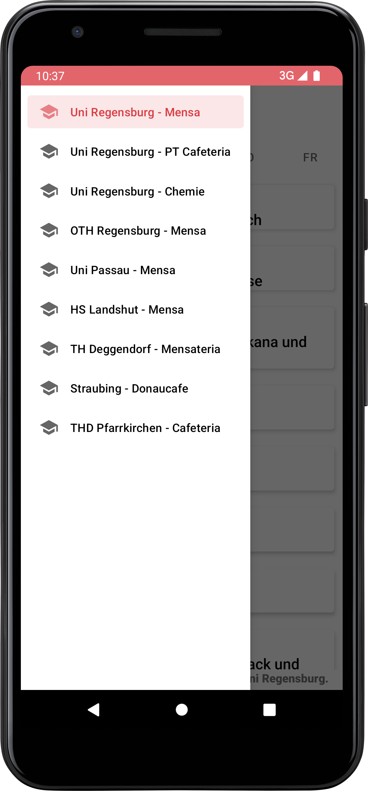

# U07 Mensa App
In dieser Woche implementieren wir eine App, die den aktuellen Mensa Speiseplan der aktuellen Woche in verschiedenen Hochschulen anzeigen kann.

## Aufgabe
Die hier entwickelte App soll den Mensaplan der aktuellen Woche für verschiedene Mensen anzeigen können. Dazu werden die entsprechenden Daten von einer *Web API* angefragt und im UI aufbereitet angezeigt. Die Nutzenden sollen in der Lage sein zwischen den Wochentagen zu wechseln und für jeden Wochentag der laufenden Woche alle Gerichte angezeigt zu bekommen. Zusätzlich soll über einen *NavigationDrawer* die Auswahl anderer Hochschulen möglich sein.

## Starterpaket
Im Starterpaket finden Sie einige Vorgaben, die den Start der Implementierung erleichtern. Die *MainActivity* ist bereits als *NavigationItemSelectedListener* registriert. Somit kann, durch Wischen von links nach rechts, die Navigation geöffnet werden. Durch Klicken auf einen Eintrag wird dieser als aktiv markiert und die Leiste wieder geschlossen. Die Auswirkungen dieser Auswahl auf die restliche Anwendung müssen aber noch implementiert werden. Außerdem wurde in der MainActivity bereits ein Listener auf das *TabLayout* registriert, in welchem die Wochentage angezeigt und ausgewählt werden. In der `onTagSelected` Methode des anonymen inneren `TabSelectedListener` können Sie auf Klicks auf einzelne Tabs reagieren. Die Position des angeklickten Tabs erhalten Sie durch `tab.getPosition()`.

Darüber hinaus sind der `MensaDataAdapter` und der `MensaDataViewHolder` bereits vorgegeben. Diese erlauben es durch Aufruf der `setMenu()` Methode des *MensaDataAdapters* Views für die übergebene `ArrayList` von `MensaDish` Objekten zu erzeugen und in einem *RecyclerView*, der im *activity_main* layout zu finden ist, einzufügen. RecyclerView und Adapter müssen aber noch verbunden werden und der Aufruf der `setMenu` Methode muss an geeigneter Stelle umgesetzt werden.

Die Klasse `MensaDish` ist ebenfalls gegeben. Diese repräsentiert ein einzelnes Gericht des Menus. Ein Gericht wird beschrieben durch einen Namen, einen Tag an dem es verfügbar ist und eine Kategorie (Hauptgericht, Beilage, Dessert). Der Kopf der *statischen* `fromJSONObject` Methode ist ebenfalls bereits gegeben. Nutzen Sie diese Methode, um aus dem JSON das von der API erhalten wird ein MensaDish-Objekt zu erzeugen.

Zusätzlich sind drei Enums gegeben die mögliche Kategorien der Gerichte, Wochentage an denen die Mensen offen haben und Orte, die in der App und API verfügbar sind abbilden.

## Daten
Die Daten/Menüs sind über den Link *https://mensa.software-engineering.education/mensa/$PLACE/$DAY* verfügbar. Dabei muss `$PLACE` durch einen Code für eine Mensa (siehe Places enum) und `$DAY` durch eine Kurzbezeichnung eines Wochentags (siehe Weekday enum) ausgetauscht werden. Die API liefert als Antwort einen JSON-formatierten String. Die oberste Ebene bildet dabei ein JSON-Array, in diesem sind mehere JSON-Objekte enthalten, wobei jedes ein Gericht repräsentiert. Die Objekte haben die folgende Form:

```json
[{
    "name": "name des gerichts",
    "day": "Wochentag Kurzform",
    "category": "Kategorie",
    "labels": "Label z.B. als vegan",
    "cost": {
        "students": "Preis für Studierede z.B. 0,75",
        "employees": "Preis für Mitarbeitende",
        "guests": "Preis für andere"
    },
    "id": 111,
    "upvotes": 0,
    "downvotes": 0
},
// ... mehr Gerichte
]
```
Für uns relevant sind dabei nur die Felder `name`, `day` und `category`. Sie können die API auch ohne App testen, rufen Sie dazu einfach die URL im Browser auf.

## Allgemeine Hinweise

* Verwenden Sie für die Anfragen an den Server das _Volley_-Framework, das [hier](https://developer.android.com/training/volley) näher beschrieben wird. Wir haben die _Library_ bereits in der _Gradle_-Datei des Starterpakets eingetragen.
* Die JSON-formatierte Antwort des Servers können Sie über die Funktionalitäten der Klassen [`JSONArray`](https://developer.android.com/reference/org/json/JSONArray) und [`JSONObject`](https://developer.android.com/reference/org/json/JSONObject) verarbeiten und in eigene Objekte überführen.

## Vorgehen

### Schritt 1: Starterpaket öffnen
Laden Sie sich das Starterpaket herunter und öffnen Sie dieses in Android Studio. Machen Sie sich mit dem vorgegebenen Code vertraut und versuchen Sie das Starterpaket auf dem Emulator (oder ihrem physischen Smartphone) auszuführen.

**Zwischenziel**: Das Starterpaket kann auf dem Emulator ausgeführt werden. Dabei wird eine leere Liste, eine Wochentagauswahl und eine Überschrift angzeigt. Durch Wischen von links nach rechts kann die Nevigationsleiste geöffnet werden.

### Schritt 2: Anzeigen von Gerichten im UI
Erzeugen Sie nun eine Klasse, die die Gerichte in einer Liste verwaltet. Die Klasse sollte außerdem eine Methode beinhalten, mit der alle Gerichte für einen übergebenen Wochentag `WeekDay` Enum zurückgegeben werden können. Fügen Sie zum Testen im Konstruktor der Klasse einige Gerichte zur Liste hinzu. Den Code zum hinzufügen dieser Gerichte sollten Sie nach Abschluss dieses Schrittes wieder entfernen.

Verbinden Sie nun den RecyclerView aus dem Layout mit einem Adapter (`MensaDataAdapter` Klasse). Sorgen Sie dafür, dass beim Klick auf einen Wochentag im *TabLayout* die Gerichte, die in der Liste von Gerichten verfügbar sind und zu diesem Wochentag passen im RecyclerView angezeigt werden.

**Zwischenziel**: Beim Starten der Anwendung sollten nun die programmatisch hinzugefügten Gerichte in der Liste angezeigt werden, wenn der passende Wochentag ausgewählt ist bzw. angeklickt wurde.

### Schritt 3: API Anfrage stellen
Erzeugen Sie nun eine Klasse mit der Sie Anfragen an die API stellen können. Die Klasse sollte die Möglichkeit haben, eine initiale Anfrage an die API zu stellen (initial ist die Uni Regensburg Mensa ausgewählt) und weitere Anfragen für übergebene Orte zu stellen.

Bei einer Anfrage sollten alle Gerichte für die gesamte Wochen (jeden Tag im `WeekDay` Enum) geladen werden. Nutzen sie dafür die `RequestQueue` Klasse des Volley Frameworks. Eine neue Queue erstellen Sie über `Volley.newRequestQueue(context)`. Dieser queue können Sie dann Anfragen, in Form von `StringRequest` Objekten, hinzufügen und anschließend alle Anfragen auf einmal über die `start` Methode der Queue abschicken.

Ein `StringRequest` Objekt erstellen Sie über `new StringRequest()`, wobei die Anfrage Methode (Hier `Request.Method.GET` aus dem Volley Framework), die API-URL, ein `Response.Listener` und ein `Response.ErrorListener` übergeben werden müssen. Implementieren Sie die Listener Interfaces in Ihrer Klasse.

Loggen Sie vorerst die Antworten der API auf der Konsole. Erzeugen Sie dann im Konstruktor der Klasse, die Sie zur Verwaltung Ihres Menüs nutzen, eine Instanz Ihrer neuen Klasse für Anfragen. Stellen direkt nach dem Erzeugen des Objekts die initiale Anfrage.

**Zwischenziel**: Beim Start der Anwendung sollten auf der Konsole fünf JSON-Strings ausgegeben werden, die den Menüs der einzelnen Wochentage in der Mensa der Universität Regensburg entsprechen.

### Schritt 4: Verbinden von API und UI
Nun wollen wir die von der API geladenen Daten im UI anzeigen. Verwenden Sie dazu an geeigneten Stellen Listener. Zunächst muss aber der String, den wir als Antwort von der API erhalten in ein Java Objekt, dass einfacher zu verarbeiten ist, umgewandelt werden. Verwenden Sie dazu die `JSONArray` Klasse. Wenn die API für jeden Wochentag eine Antwort (oder einen Fehler) geliefert hat, soll eine andere Stelle des Programms, die sich um die interne Verwaltung der Daten kümmert, informiert werden und das fertige `JSONArray` erhalten.

Dort muss das aktuell gespeicherte Menü durch ein neues ersetzt werden. Verwenden Sie zur Umwandlung der JSON-Objekte in Instanzen der `MensaDish` Klasse die `fromJSONObject` Methode der `MensaDish` Klasse. Diese müssen Sie noch fertig implementieren.

Nachdem aus allen JSON Objekten *MensaDish* Objekte erzeugt und gespeichert wurden, muss der Adapter informiert werden, dass die Gerichte sich geändert haben. Dadurch wird das UI angepasst. Achten Sie darauf, dass die Gerichte für den korrekten, aktuell selektierten Tag angezeigt werden.

**Zwischenziel**: Beim Aufruf der Anwendung wird das Wochenmenü der Mensa der Universität Regensburg von der API geladen und in der Liste angezeigt. Man kann zwischen Wochentagen wechseln.

### Schritt 5: Andere Mensen
Sorgen Sie nun dafür, dass Menüs anderer Mensen abgefragt werden können. Die Nutzenden sollen beim Klick auf ein Element in der Navigationsleiste eine andere Mensa auswählen können. Der Klick auf ein Element des Navigationsmenüs wird in der `onNavigationItemSelected` Methode abgefangen. Nutzen Sie das `Places` Enum, um die API Anfrage dahingehend zu ändern, dass Daten eines anderen Ortes abgefragt werden. Achten Sie darauf, dass bei jedem Aufruf der API fünf Antworten gebraucht werden. Sorgen Sie dafür, dass (nur) das Menü der selektierten Mensa in der Liste angezeigt wird.

**Zwischenziel**: Die Mensa kann nun gewechelt werden. Bei der Auswahl einer anderen Mensa wird das angezeigte Menü entsprechend der Antwort der API geändert.

## Erweiterungen

### Mehr Mensen
Die API, die wir verwenden bietet einen einfachen Zugriff auf die Menüs einiger Mensen. Leider ist die Auswahl aber beschränkt. Deutlich mehr Mensen gibt es bei [OpenMensa](https://openmensa.org). Anfragen an diese API können ähnlich gestellt werden. Unsere URL, sowie die Umwandlung der Antwort in `MensaDish`-Objekte müssen wir aber anpassen.

## Screenshots
|  Menü aus Regensburg  | Navigation zwischen Mensen |
|:------:|:-------:|
|  |  | 